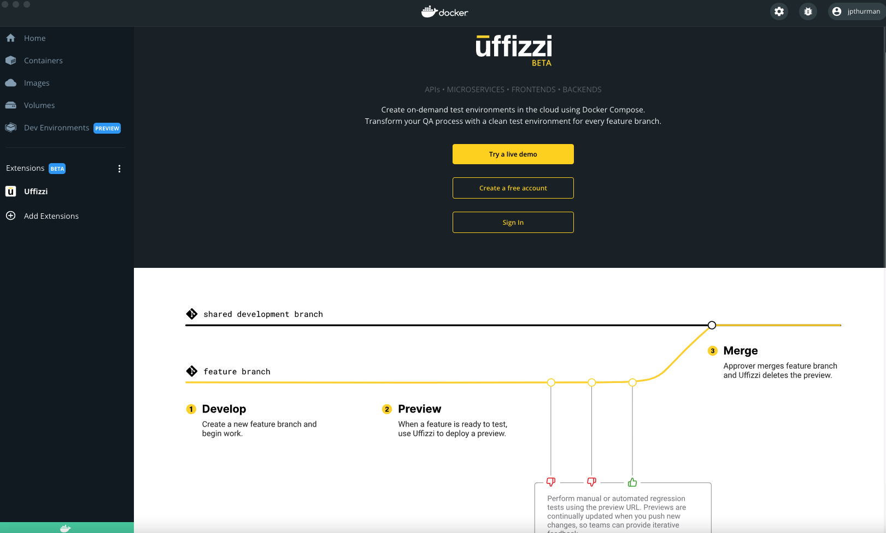
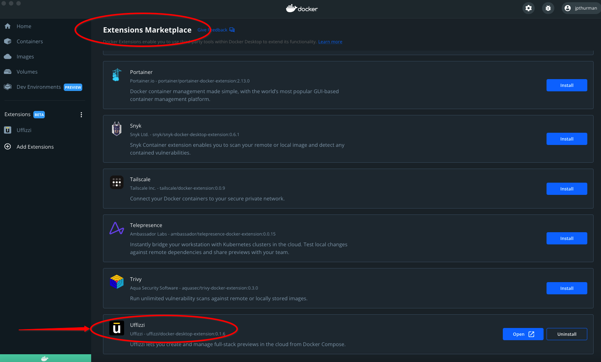
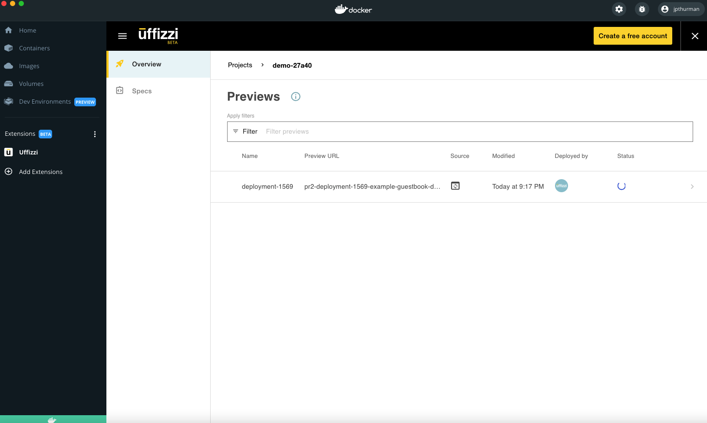
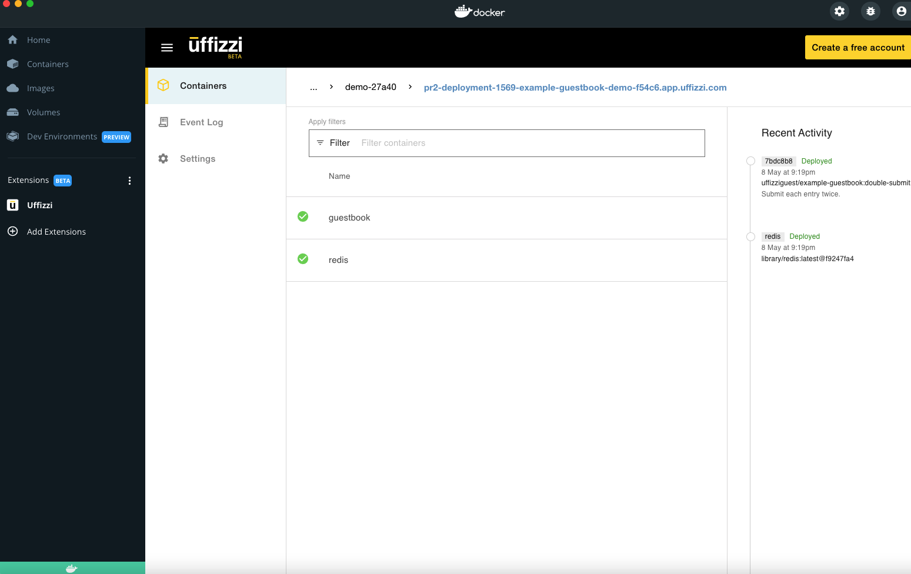
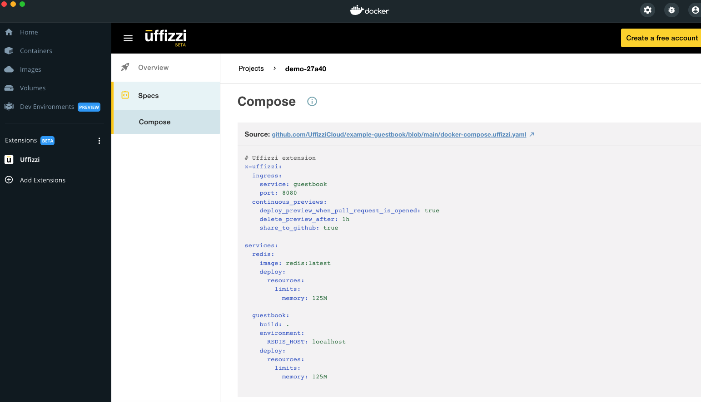
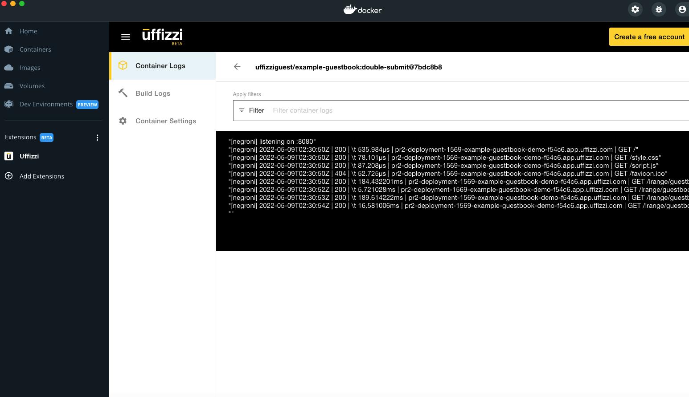

# Announcing the Uffizzi Docker Desktop Extension: Test Your Compose Stack In An On-Demand Cloud Environment
May 10th, 2022 – by [Josh Thurman](https://twitter.com/joshthurman19) 

Today we are thrilled to announce that Uffizzi is one of the first Extensions live on the Docker Desktop marketplace.  Through the Docker Extensions Program we are making Uffizzi’s on-demand full-stack preview environments accessible within the Docker Desktop interface.

This means Developers can streamline their workflows and reduce context switching to do their best work.  Through Desktop and the Uffizzi Extension Developers now have the ability to manage their compose stack both locally and in an on-demand cloud environment.  

 

Uffizzi extends Docker and Docker Desktop‘s capability by taking the popular Docker Compose configuration and applying it to on-demand cloud environments.  This means that the millions of developers who use the compose stack for testing their application locally can now use that same configuration to define production-like test environments that are accessible at a secure, shareable URL.  

Teams using Uffizzi are transforming how they test new features with clean, production-like preview environments for every feature.  The Continuous Previews capability that Uffizzi provides empowers teams to iterate faster and improve their overall development velocity.  With our commitment to Docker Compose as a configuration, the Docker Extensions Partnership is a natural fit and is a big win for Developers.

Series A Fintech [Tilled.com](https://tilled.com/)’s Head of DevOps and Quality Butch Mayhew noted regarding the Extension, “Uffizzi is super valuable to me, I don’t have to worry about the infrastructure, I just have to have a docker compose file and let Uffizzi do the hard work . . . it allows us to get feedback quickly in an automated fashion and also gives us a place to do some exploratory testing so as we get that merge to develop we’ll have high confidence in our releases.” 

The real power of Uffizzi’s on-demand environments is that they enable Developers and their teams to test new features in isolation and with all their dependencies.  This eliminates the variables of commingled code being simultaneously introduced into what we would call a dirty environment.  Introducing new features into an existing code base is hard enough, and when you can eliminate variables it’s a game-changer for how efficiently your team can release new features.

Historically Docker Desktop has been an inner loop tool that organizes individual Developer workflows as they iterate.  With the Uffizzi Extension, Desktop becomes a powerful outer loop tool that enables key stakeholders on your cross-functional team – whether it be peer review, QA, or product– to shift left and provide feedback on in-progress development.

If you'd like to try Uffizzi you can start with a [Live Demo](https://uffizzi.com) on our main site or jump right into the [Docker Desktop Extensions Marketplace](https://www.docker.com/blog/
docker-extensions-discover-build-integrate-new-tools-into-docker-desktop).
 
## Relevant Resources

-[Uffizzi Testimonials – How Series A Fintech tilled.com uses Uffizzi to achieve “high confidence releases”](https://www.youtube.com/watch?v=vPVBcq8qzj4&t=2s)

-Download [Docker Desktop](https://www.docker.com/products/docker-desktop)

-Github @UffizziCloud 

-Twitter [@Uffizzi_](https://twitter.com/Uffizzi_)

## Screenshots

 

