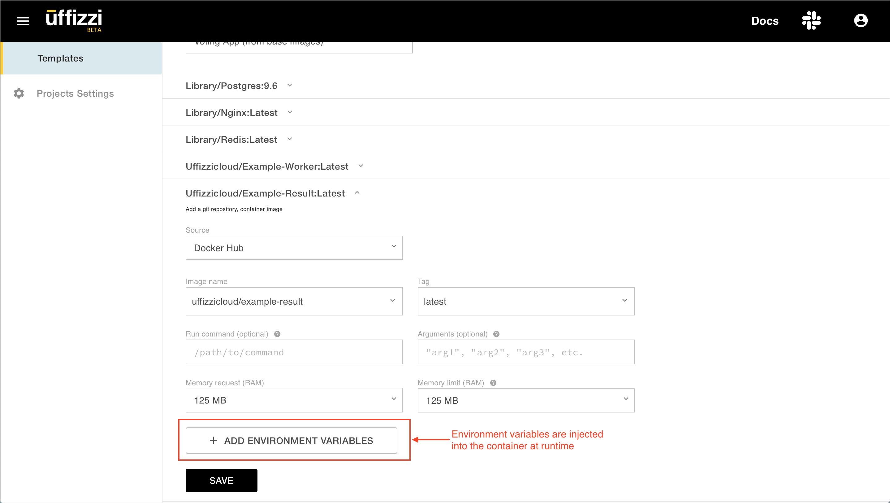
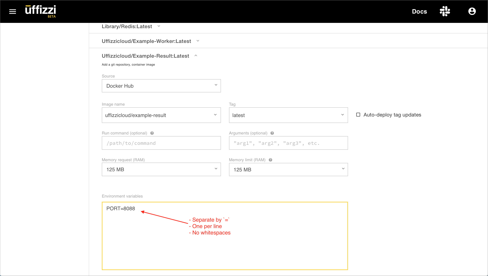

# Environment Variables  

Environment variables are name/value pairs that are dynamically loaded into your containers at runtime. They are often used to pass configuration details to your application. Using environment variables instead of hard-coded values lets you keep environment-specific details out of your source code.  

There are two ways to provide environment variables to your containers, depending on the method you use to define your application stack:  

### 1. For Compose-based Previews  
If your Previews are defined by a [Uffizzi Compose file](references/compose_spec.md), you have two options for adding environment variables to your containers: `environment` or `env_file`.  

* Use `environment` if you have a small number of environment variables to add. You can list your variables in an `environment` block within the service definition. For example, the following `uffizzi-compose.yml` snippet adds two environment variables, `FOO` and `BAR`, to the `myservice` container:    
```    
services:
    mysevice:
      image: example/myservice:latest
      environment:
        FOO: bar
        BAR: baz
```

* Use `env_file` if you have a large number of enviroment variables that would otherwise clutter up your compose file. You can store your variables in a file within your repository and use the `env_file` component to specify the path to this file. For example, the following `uffizzi-compose.yml` snippet tells Uffizzi to read the contents of `envs/myconfigs.env` and add them to the container `myservice`:  
```
services:
    mysevice:
      image: example/myservice:latest
      env_file: ./envs/myconfigs.env
```

### 2. For Template-based Previews  
Templates allow you to define and manage your application stack with a simple graphical user interface. If you use Templates to define your Previews, you can add environment variables when you add each application component to your Template. After adding a new component to your Template (e.g., a GitHub repository or container image), select the **ADD ENVIRONMENT VARIABLES** button to copy and paste your environment variables into the text box provided. Environment variables should be formatted as name/value pairs with the following requirements:  

* Add one name/value pair per line   
* Separate name and value by `=`  
* Do not include whitespaces  

For example:  

```        
FOO=bar                    # valid
baz=bar                    # valid
FOO=bar baz=bar            # invalid
FOO = bar                  # invalid
```
&nbsp;  


&nbsp;  

