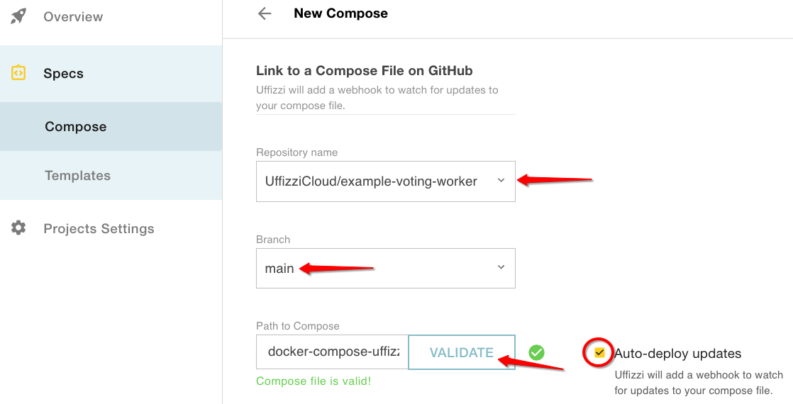
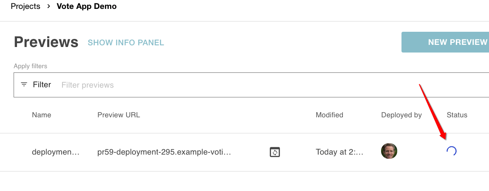
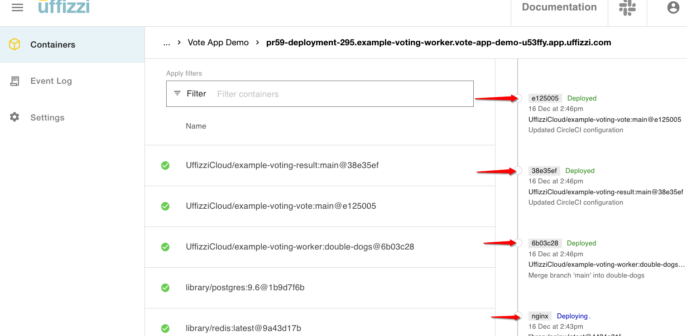
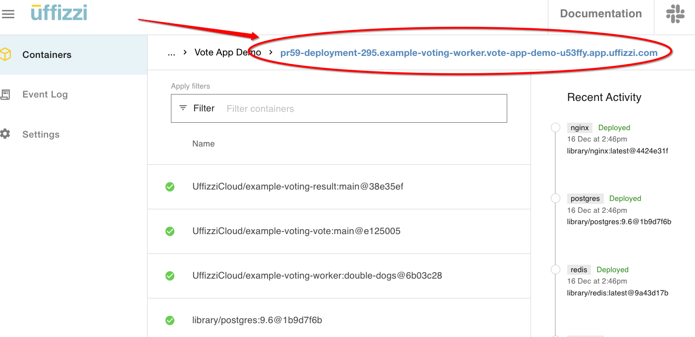
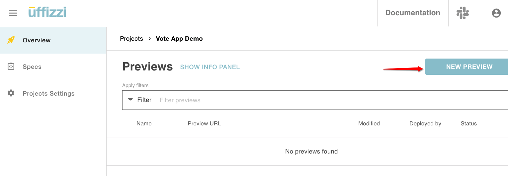

##Configuration

**Compose**  - A configuration-as-code YAML - `docker-compose.uffizzi.yml`- based on Docker Compose (version 3.9) .
            Unless otherwise noted, Uffizzi recognizes Docker Compose syntax.


##Build Options

Option 1- **Use Uffizzi's Integrated Build** - Uffizzi will build from source from your connected VCS.

   *This is for users who want Uffizzi to manage the full build and deploy processs.
   
Option 2- **Bring Your Own Build** (BYOB) - Use your existing CI/CD to handle the Build. 
     
   *This is for users who have custom builds or who are using a VCS that is not yet integrated with Uffizzi.

##Integrations and Webhooks

Out-of-the-box Uffizzi supports integrations with Github, Docker Hub, AWS' Elastic Container Registry, Azure's Container Registry, and Google's Container Registry.  Ensure you have connected to the relevant Repos and Registries at the Account Level Settings.  

Uffizzi will automatically set-up webhooks with Github and Docker Hub.  For ECR, ACR, and GCR the user must manually set-up the [webhooks](guides/container-registry-integrations.md).

## Configure previews with Uffizzi Compose 

1. **Create a Uffizzi Compose file** - Start with your `docker-compose.yml` and create a new file named `docker-compose.uffizzi.yml`.  Check the [Uffizzi Compose reference](references/compose-spec.md) and [these examples](examples/example-compose.md) for detailed information on how to write your `docker-compose.uffizzi.yml`.  

2. **Add the Uffizzi extension** - Add the [`x-uffizzi`](references/compose-spec.md#x-uffizzi) object to your `docker-compose.uffizzi.yml` and commit it to the top level of the `main` or primary branch in your repository.  


3. **Connect your compose** - Within the Uffizzi Dashboard (UI) go to **Projects** > **Specs** > **Compose** and select **NEW COMPOSE** to connect to your `docker-compose.uffizzi.yml` which should be stored in your git repository.  To connect to your repository see [Configure GitHub](guides/git-integrations.md).  

After adding the repo, branch, and path, select the **VALIDATE & SAVE** button. Uffizzi will confirm if your file is valid or will provide error messaging that indicates what needs to be addressed.  

If you want `uffizzi_app` to recognize changes to your `docker-compose.uffizzi.yml` check the Box for "Auto-deploy updates".

Once you've added your compose file, return to the project's **Overview** page.  

## Trigger a preview  

### Trigger preview with open pull request  
 
 To trigger a preview by opening a pull request, you must:  

1. Ensure your GitHub account is properly [conencted and configured with a webhook](guides/git-integrations.md).  
2. Define your services in your `docker-compose.uffizzi.yml` using the `build` element, [specifying your GitHub repository as the build `context`](references/compose-spec.md#build). For example: 
 ```
 services:  
   foo:
     build:
       context: https://github.com/example/foo
 ```  

Once you have enabled previews to trigger on new pull requests (via [`deploy_preview_when_pull_request_is_opened`](references/compose-spec.md#deploy_preview_when_pull_request_is_opened)), then simply open a pull request on GitHub to kick off a new preview. The webhook configured within your git repo will inform Uffizzi of the open pull request and initiate the preview.   


### Trigger preview with new tag ([Bring Your Own Build](engineeringblog/ci-cd-registry.md))  
To trigger a preview via a new tag, you must:  

1. Configure your build system to tag images created from new pull requests with `uffizzi_request_#` where `#` is the pull request number.  
2. Ensure your container registry is properly [conencted and configured with a webhook](guides/container-registry-integrations.md).  
3. Define your services in your `docker-compose.uffizzi.yml` using the `image` element. For example: 
```
services:  
  foo:
   image: example.azurecr.io/foo
```

When a preview is triggered, Uffizzi will show the new preview and its status:  


The preview will take a few minutes to finish deploying (The build process is typically the longest part of the sequence). You can monitor the status by clicking on your preview. Within the UI you can monitor the activity log, build logs, individual container logs, and event logs.  


When the preview has finished deploying, the preview URL turns blue. The link is now live, and you can securely access your preview. Please note that if you have deployed multiple containers, some of those containers may still take time to fully initiate after the preview URL goes live.  


## Deleting a trigger-based preview

1. **Close pull request** - If you have set [`delete_pull_request_when_pull_request_is_closed: true`](references/compose-spec.md#delete_pull_request_when_pull_request_is_closed) in your compose file, your preview will be deleted by merging or closing the respective pull request that initiated the preview.  

2. **Timeout** - If you have set [`delete_preview_after: [value]`](references/compose-spec.md#delete_preview_after), your preview will be deleted after the specified amount of time.

3. **Manual** - You can always manually delete a preview by selecting the delete icon in the Uffizzi Dashboard:  


If you have specify both `delete_pull_request_when_pull_request_is_closed: true` and `delete_preview_after: [value]`, Uffizzi will abide by whichever trigger fires first.  

> **Note**: Images typically do not have a well-defined lifecycle the way that a PR does. That is, unlike a PR that is opened/closed, images are often never (or rarely) deleted. For this reason, the only way to programmatically delete a preview initiated via a new image/tag, is via `delete_preview_after: [value]` element. This will be improved with future releases.  

## Initiating a manual preview

Alternatively, you can select **NEW PREVIEW** from the UI and choose a compose from within your connected repository.  If you use this method to initiate a preview you must manually delete it from the UI.  




## Deleting a manual preview

You can always delete a preview by selecting the delete icon in the UI:  


