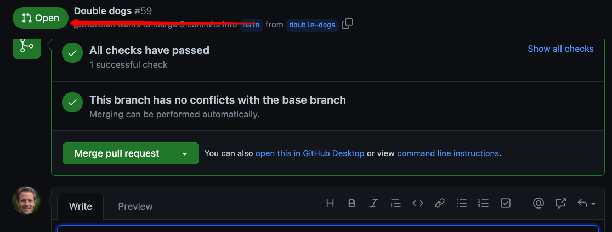

There are two ways to configure previews on Uffizzi:  

* Compose  - A configuration-as-code YAML based on Docker Compose (version 3.9).
            Unless otherwise noted, Uffizzi recognizes Docker Compose syntax.
* Templates - Configurations created and managed in the Uffizzi Web Interface (GUI).  

## With Compose

1. Write Your Compose - You'll want to start with your docker-compose.yml and make a few additions.  Check [References](https://docs.uffizzi.com/references/compose-spec/) for examples and detailed information on how to write your `docker-compose-uffizzi.yml`.  

2. Save your `docker-compose-uffizzi.yml` at the top level of your `main` or primary branch in your repository.  

### Connecting Your Compose

3. Within the Uffizzi UI go to Projects/Specs/Compose and select `new compose` to connect to your `docker-compose-uffizzi.yml` which should be stored in your git repository.  To connect to your repository see [Source Code Integrations](https://docs.uffizzi.com/setup/source-code-integrations/).

After adding the repo, branch, and path, select the `validate` button - Uffizzi will confirm if your file is valid or will provide error messaging that indicates what needs to be addressed.

Save your setting and return to Project Overview.  

### Initiating a Trigger-based Preview

1. `Open / Close Pull Request` triggers - If you have enabled Pull Request triggers in your compose you can now initiate a preview by opening a `pull request` within any git repository that is invoked by your `docker-compose-uffizzi.yml`.

The webhook within your git repo will inform `uffizzi_app` of the `Open PR` and initiate the Preview.

The Preview deployment will take a few minutes to spin up - the build process is typically the longest part of the sequence.  You can monitor the status by clicking on your Preview.

When your Preview URL turns blue the link is now live and you can securely access your Preview.  Please note that if you have deployed multiple containers they may still be initiating

### Initiating a Manual Preview

Alternatively, you can select `new preview` from the UI and choose a compose from within your connected repository to deploy a preview.  If you use this method to initiate a preview you must manually delete it.

## With Templates
