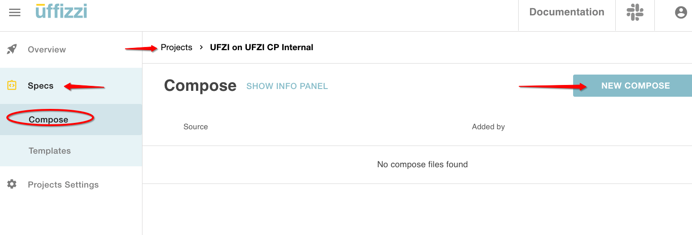
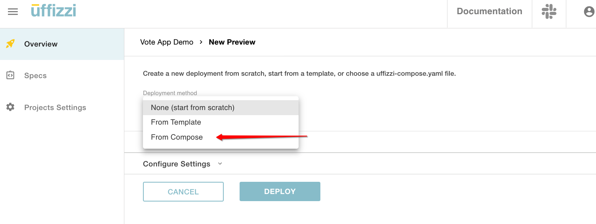
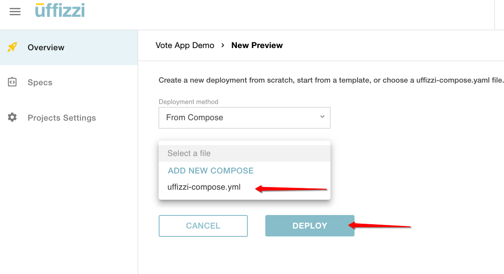

There are two ways to configure previews on Uffizzi:  

* Compose  - A configuration-as-code YAML based on Docker Compose (version 3.9).
            Unless otherwise noted, Uffizzi recognizes Docker Compose syntax.
* Templates - Configurations created and managed in the Uffizzi Web Interface (GUI).  

## With Compose

Check the References section for examples and detailed information on how to write your `docker-compose-uffizzi.yml`.  We recommend that your `docker-compose-uffizzi.yml` be saved at the top level of your `main` branch in your repository.  

Within the Uffizzi UI go to Projects/Specs/Compose and select `new compose` to connect your `docker-compose-uffizzi.yml`.

After adding the repo, branch, and path, select the `validate` button - Uffizzi will confirm if your file is valid or will provide error messaging that indicates what needs to be addressed in your `docker-compose-uffizzi.yml`.

Save your setting and return to Project Overview.  If you have enabled trigger-based previews you can now initiate a preview based on that trigger.  

Alternatively, you can select `new preview` from the UI and choose a compose from within your connected repository to deploy a preview.  If you use this method to initiate a preview you must manually delete it.

## With Templates
